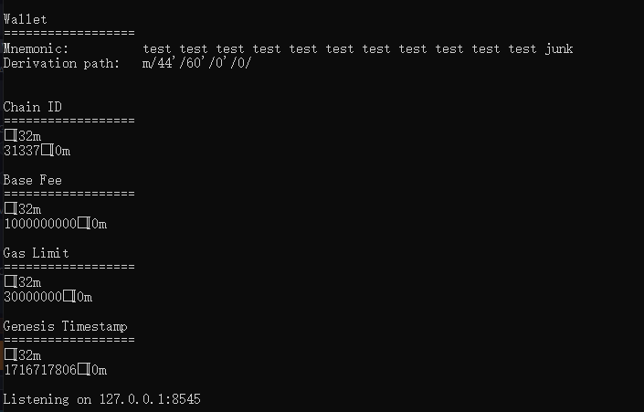
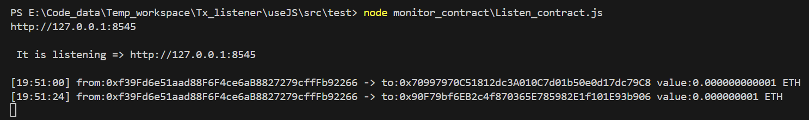
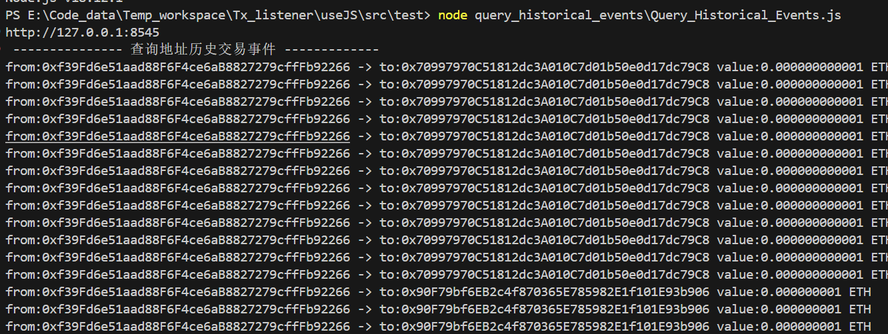

# Tx_Listener

### 前言

> 这是一个简单的demo，方便我的学习和理解。
>
> demo的理念：
>
> 我只实现了监听ERC20 Token的`transfer()`函数，至于其他类型的监听我没有完善。
>
> extension部分的内容则是监听ERC20 Token 的 `event Transfer(address indexed from, address indexed to, uint value)`事件。

### 1. core

##### 1.1  目标

该仓库旨在简单复现，`扫区块`。

- 监听交易，在区块中监听 `from` 和 `to`地址；

- 监听交易确认。

##### 1.2 实现思路

- 监听未上链交易：监听以太坊的`mempool`，这里存储着未上链的交易（即矿工未打包的交易）。只要时刻监听`mempool`中的`txHash`，然后将该`txHash`解析出来，获取要监听的`from`和`to`地址，并从业务逻辑中所需检测的地址进行比对，如果两者匹配成功，则做出`response1`，如果不匹配则继续监听。

- 监听已经打包好区块：通过监听以太坊链上最新打包的区块，从区块中读取所有交易，依次遍历，找到与上一步监听响应的 `txHash`像匹配的交易，通过`txHash`获取交易对象，并解析`status`的值来判断交易是否执行成功。

##### 1.3 复现

测试环境：foundry启动的本地节点。



假设我需要监听的`from`和`to`分别为：

```js
// moniter these addersses
const fromAddress = ["0xf39Fd6e51aad88F6F4ce6aB8827279cffFb92266"];
const toAddress = [
    "0xf39Fd6e51aad88F6F4ce6aB8827279cffFb92266",
    "0x70997970C51812dc3A010C7d01b50e0d17dc79C8",
    "0x3C44CdDdB6a900fa2b585dd299e03d12FA4293BC",
];
```

- a. 部署好`MyToken`合约地址：`0x5FbDB2315678afecb367f032d93F642f64180aa3`

- b.  在本地启动 `node monitor_mempool\Monitor_Mempool.js`

- c. 在 remix 上调用`transfer(address,uint256)`函数，msg.sender=0xf39Fd6e51aad88F6F4ce6aB8827279cffFb92266，to=0x70997970C51812dc3A010C7d01b50e0d17dc79C8, value=1e6 wei

    

- 

### 2. extension

##### 2.1 monitor_contract

这个脚本的功能是：监听某ERC20 Token合约上的 `Transfer`事件，可以通过过滤器来指定监听某些字段。

该脚本的过滤器是为了过滤出指定的接收者才会被捕捉。

过滤器为：

```js
// to moniter addresses
const toAddresses = [
    "0x70997970C51812dc3A010C7d01b50e0d17dc79C8", 
    "0x90F79bf6EB2c4f870365E785982E1f101E93b906"
];

// set filter to moniter toAddresses
let filterTo = contract_MyToken.filters.Transfer(null, toAddresses);
```

- 在remix执行转账操作



##### 2.2 query_historical_events

这个脚本的功能是：监听某ERC20 Token合约上的**历史** `Transfer`事件，可以通过过滤器来指定监听某些字段。

该脚本的过滤器是为了过滤出指定的接收者才会被捕捉。

过滤器为：

```solidity
// to moniter addresses
const toAddresses = [
    "0x70997970C51812dc3A010C7d01b50e0d17dc79C8", 
    "0x90F79bf6EB2c4f870365E785982E1f101E93b906"
];

// set filter to moniter toAddresses
let filterTo = contract_MyToken.filters.Transfer(null, toAddresses);
```

- 执行脚本

